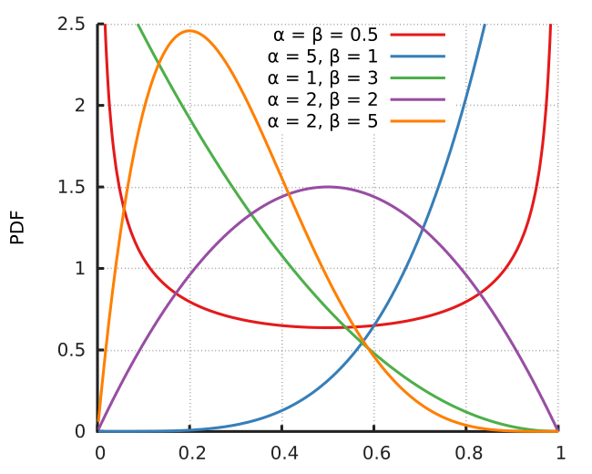

**Topic in Data Science: Spectral Method and Nonconvex optimization**

literature review
- Paper: [Spectral method meet EM](https://www.jmlr.org/papers/volume17/14-511/14-511.pdf)
- [data and matlab implement by author](https://github.com/zhangyuc/SpectralMethodsMeetEM)
- team member: Aoxue Chen, Song Liang
- Other references:
    - [Tensor decompositions for learning latent variable models](https://www.jmlr.org/papers/volume15/anandkumar14b/anandkumar14b.pdf)

## Todo: 
Interesting problems that raise along with our implementation:

- [x] $M_2$和$M_3$是不是对称张量有没有影响？（已在函数中整合是否寻找临近对称张量的参数`sym`）
- [x] 迭代次数
- [x] 分组的影响
- [ ] 拟合的confusion matrix是负数的话需不需要在0处截断（已在函数中整合截断选择参数`cutoff`）
- [ ] 除了论文里的特例，提出其他特例/极端情况
- [ ] 有没有什么步骤是不需要的？
- [ ] 收集或模拟其他数据，测试该算法在什么情况下效果比较好/差
- [ ] 缺失数据的量、数据规模、类别数量等因素对算法是否有影响
- [x] 使用张量操作代替循环以提高算法性能（已完成）
- [x] 在有人没给很多物品打标的情况下效果不是很好（已解决）
- [x] Singular matrix报错
    - 原因：有的C_c某列全是0
        - 原因：set the lth column of Cc by some mu_h whose l-th coordinate has the greatest component
        - 原论文解决方式：随机选择（不可行，两列一样照样是singular）
        - 原代码解决方式：如果重合直接找到第一个空位填进去(web,sym=False, seed=123,error=0.06429319659831827)，优点：不用随机数，缺点：不稳定，如[4,4,0,1,2]会把012都挤到下一格
        - 改进：从没被选择的mu里选择(web,sym=False, seed=123, error=0.0830290549282322)


## Packages
```
import numpy as np
from utils import transform_data, get_confusion_matrix, errorRate
from EMfunctions import spectralEM
```

## Data generator

**Generator**(num_worker=100, num_item=1000, num_category=2, alpha=2, beta=2). To generate sparse data set, we set the probability of a worker to label an item follows $beta(\alpha, \beta)$ distribution.

```
g = Generator(num_worker=10, num_item=10)
```



**confusionMatrix**(anomaly_prop=0.05, true_prob=np.array([0.3, 0.9]), false_prob=np.array([0.0, 0.5]))

True_prob is the parameter for diagonal elements of confusion matrix. False_prob is the parameter for non-diagonal elements of confusion matrix.

```
CM = g.confusionMatrix()
```

**generate_item_label**(prob=[0.5,0.5])

prob is the ground truth label probability vector, which represent the distribution of labels. The length of `prob` should equal to the number of category.

```
truth = g.generate_item_label()
```

**generate_worker_label**(CM, truth)

`CM` is short for confusion matrix, `truth` ground true label.

```
label = g.generate_worker_label(CM, truth)
```

**save data to txt**

```
np.savetxt('synthetic_data/1_truth.txt', truth, delimiter=' ', fmt='%d')
np.savetxt('synthetic_data/1_crowd.txt', label, delimiter=' ', fmt='%d')
```

## Load and transform data
```
df = np.loadtxt('data/rte_crowd.txt')
df = transform_data(df)

truth = np.loadtxt('data/rte_truth.txt')
```

## Use spectral method to initialize starting points

**get_confusion_matrix**(k, labels, groups=None, sym=True, cutoff=1e-7, L=50, N=10, seed=None)

`k` is number of categories. `labels` is worker*item matrix.

```
init_mu = get_confusion_matrix(k=2, labels=df)
```

## Expectation-maximization 

to instantiate the class, we need input init_mu and labels, where are initialization points from spectral method and worker labeled data respectively. In spectralEM.run() method, we can choose `converge` or `max_iter` two stop strategy.

```
EM_optimizor = spectralEM(init_mu=init_mu, labels=df)
logLik = EM_optimizor.run(strategy='converge', delta=1e-2)
print(logLik)
```

## Prediction and error rate

```
error = errorRate(EM_optimizor.output_q(), truth)
print(error)
```
